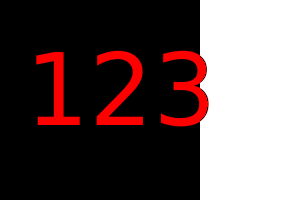

# SVG Logo Maker

## Description

The objective of this project is to generate a simple logo for projects.
The goal was to create logo faster by imposing text on top of a colored shape.
We wanted to limit the characters up to 3 we have decided most things could be a three letter acronym (TLA).
But also because we wanted to make sure the shapes were uniformly bound to a 300x200 size

## Table of Contents

- [SVG Logo Maker](#svg-logo-maker)
  - [Description](#description)
  - [Table of Contents](#table-of-contents)
  - [Installation](#installation)
  - [Usage](#usage)
  - [License](#license)
  - [Questions](#questions)

## Installation

Download the zip file from my github repo

## Usage

- Open it up in terminal
- run it with node index.js
- Move ``the output.svg`` to whereever you need it

[Video link](https://drive.google.com/file/d/1M58eROMNVkfpWOD2fn5kNc3jWL1vafEd/view)

## License

[No License](https://choosealicense.com/no-permission/)

## Questions

You can reach me at
- Github: [19dbo91](https://github.com/19dbo91)
- Email: [bonilla.dustin@gmail.com](mailto:bonilla.dustin@gmail.com)
